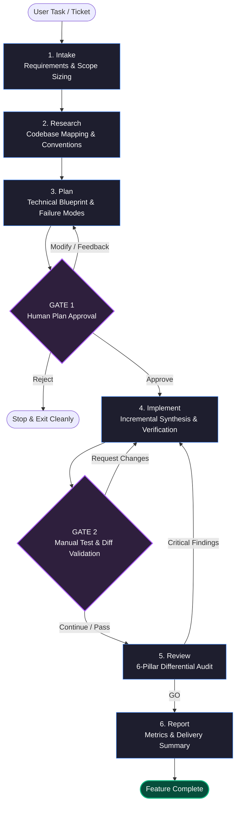

# AI Workflow & Agent Skills Hub

A production-grade orchestration framework and interactive dashboard for AI developer agent skills. This repository provides a structured, multi-agent development lifecycle with human-in-the-loop verification gates, engineered for **Antigravity IDE**, **Claude Code CLI**, and **GitHub Copilot**.

---

## 🚀 Overview

The **AI Workflow & Agent Skills Hub** transitions AI-assisted engineering from unstructured prompting into a disciplined software engineering pipeline. 

Instead of asking an AI assistant to "write a feature" in one giant, unpredictable leap, this system breaks feature delivery into **specialized, verifiable phases** coordinated by a central **Master Orchestrator** with mandatory human checkpoints.

### Key Capabilities
* **10 Universal Reusable Skills**: Modular manuals covering requirements capture, codebase exploration, technical blueprints, failure-mode mapping, implementation, differential audits, accessibility compliance, and anti-cliché design.
* **Master Orchestrator (`feature`)**: Coordinates the end-to-end lifecycle with automated complexity routing (`trivial` to `large`) and two explicit human gates.
* **Multi-Agent Compatibility**: Single source of truth inside `.agents/` mapped effortlessly to Antigravity, Claude Code, and GitHub Copilot.
* **Interactive Dashboard**: A Next.js 16 showcase interface displaying the interactive lifecycle, skill catalogs, and one-click configuration commands.

---

## 📐 Architecture & Orchestration Flow



### The Two Human-in-the-Loop Gates
1. **Gate 1 (Plan Approval — Pre-Implementation)**:
   The agent stops before touching any source code. It delivers an architectural plan containing exact `file:line` targets, quality analysis (security, performance, reusability), a failure-mode matrix, and LOC estimates. Implementation proceeds only upon explicit human approval.
2. **Gate 2 (Execution Review — Post-Implementation)**:
   The agent stops after code changes are made in the local working tree (without premature git commits). The developer can run manual tests, inspect the diff, or request revisions before passing the code to the automated review auditor.

---

## 📂 Repository Structure

```
├── .agents/
│   ├── rules/
│   │   ├── main.md                   # Core coding rules & stack standards
│   │   └── orchestration.md          # Override rules for feature orchestrator
│   └── skills/                       # Universal & showcase agent skills
│       ├── feature/SKILL.md          # 🌟 Master orchestrator pipeline
│       ├── intake/SKILL.md           # 1. Requirements capture & sizing
│       ├── research/SKILL.md         # 2. Code exploration & conventions auto-detection
│       ├── plan/SKILL.md             # 3. Technical blueprint & failure analysis
│       ├── implement/SKILL.md        # 4. Incremental code synthesis
│       ├── review/SKILL.md           # 5. Git diff auditor & quality gates
│       ├── debug/SKILL.md            # Root cause analysis & deterministic repro
│       ├── frontend-design/SKILL.md  # Anti-cliché UI design & copywriting
│       ├── react-development/SKILL.md# React & Next.js production patterns
│       ├── accessibility/SKILL.md    # WCAG 2.2 Level AA compliance
│       └── landing-design-system/    # 🎨 Showcase landing page design tokens
├── .claude/
│   └── skills -> ../.agents/skills   # Symlink for Claude Code CLI
├── .github/
│   ├── copilot-instructions.md       # Multi-agent rules for GitHub Copilot
│   └── skills -> ../.agents/skills   # Symlink for GitHub Copilot
├── AGENTS.md                         # Antigravity IDE workspace entrypoint
├── CLAUDE.md                         # Claude Code CLI workspace rules
├── app/                              # Next.js interactive dashboard UI
└── README.md
```

---

## 🧰 Skill Catalog

### 🌐 Universal Reusable Skills (Portable to ANY Project)

These skills are designed to be completely stack-agnostic or standard-conforming so you can drop them into any repository:

| Skill | Role | Purpose & Highlights |
| :--- | :--- | :--- |
| [`feature`](.agents/skills/feature/SKILL.md) | **Master Orchestrator** | Coordinates the full pipeline; manages size routing (`trivial` bypasses to `large` 5-stage) and enforces Gate 1 & Gate 2. |
| [`intake`](.agents/skills/intake/SKILL.md) | **Requirements Capture** | Resolves tickets (Jira, Linear, GitHub) or prompts into AC, estimates LOC sizing, and validates success criteria upfront. |
| [`research`](.agents/skills/research/SKILL.md) | **Codebase Exploration** | Maps existing files, auto-detects project conventions (languages, package managers), and traces async lifecycles. |
| [`plan`](.agents/skills/plan/SKILL.md) | **Technical Blueprint** | Decomposes changes into step-by-step verified actions; builds failure-mode tables and assesses security and performance. |
| [`implement`](.agents/skills/implement/SKILL.md) | **Code Synthesizer** | Executes approved plans step-by-step; enforces no drive-by refactors, no type bypasses (`any`/`ts-ignore`), and zero git pollution. |
| [`review`](.agents/skills/review/SKILL.md) | **Differential Auditor** | Audits `git diff` against 6 pillars (Validation, Impact, Idioms, Logic, Dead Code, Accessibility) with a GO/NO-GO verdict. |
| [`debug`](.agents/skills/debug/SKILL.md) | **Root Cause Analyst** | Replaces guessing with science: deterministic repro steps, competing hypotheses, and minimal disproofs. |
| [`frontend-design`](.agents/skills/frontend-design/SKILL.md) | **UI/UX Design Director** | Guides intentional typography, distinctive palettes, and conversational UX copy while explicitly banning generic AI design clichés. |
| [`react-development`](.agents/skills/react-development/SKILL.md) | **React/Next.js Standards** | Enforces component splitting, < 500 LOC guidelines, Compound Components, React Hook Form + Zod, and TanStack Query. |
| [`accessibility`](.agents/skills/accessibility/SKILL.md) | **Accessibility Auditor** | Implements POUR principles, WCAG 2.2 AA compliance, visible focus rings, ARIA labeling, and keyboard trap prevention. |

### 🎨 Showcase Specific Skill
* [`landing-design-system`](.agents/skills/landing-design-system/SKILL.md): Contains the bespoke design tokens, GT Walsheim display typography, 5px spacing grid, and atmospheric gradient spotlight cards specifically tailored for this repository's dark marketing showcase landing page.

---

## 📦 How to Export & Use These Skills in Your Own Project

To equip your existing team codebase with these agent skills:

### 1. Copy the `.agents` Directory
```bash
# Copy all skills and rules directly to your target project:
cp -r .agents/ /path/to/your-project/.agents/
```

### 2. Multi-Agent Setup in Your Target Project

* **For Antigravity IDE (Gemini)**:
  Natively supported. Antigravity automatically detects `.agents/skills/` and `.agents/rules/`. Copy or reference `.agents/rules/main.md` in your `AGENTS.md`.

* **For Claude Code (CLI)**:
  Create the Claude configuration symlink and copy the rules file:
  ```bash
  cd /path/to/your-project
  mkdir -p .claude
  ln -s ../.agents/skills .claude/skills
  cp /path/to/ai-workflow-demo/CLAUDE.md ./CLAUDE.md
  ```

* **For GitHub Copilot**:
  Create the Copilot instructions and skills symlink:
  ```bash
  cd /path/to/your-project
  mkdir -p .github
  ln -s ../.agents/skills .github/skills
  cp /path/to/ai-workflow-demo/.github/copilot-instructions.md ./.github/copilot-instructions.md
  ```

### 3. Triggering the Workflow
In your AI assistant prompt bar, trigger the orchestrator:
```text
@feature Implement user authentication modal with password reset and email validation
```
The agent will execute `intake` ➔ `research` ➔ `plan`, halt for your approval at **Gate 1**, then synthesize code and pause at **Gate 2** for your testing!

---

## 🛠️ Technology Stack (Dashboard Showcase)

* **Framework**: [Next.js 16](https://nextjs.org/) (App Router, Turbopack)
* **Runtime & Package Manager**: [Bun 1.3+](https://bun.sh/)
* **Styling**: [Tailwind CSS v4](https://tailwindcss.com/)
* **Typography**: Geist Sans & Mono + Framer-style OpenType character variants

---

## 🏃 Local Development

### 1. Installation
```bash
bun install
```

### 2. Run the Development Server
```bash
bun run dev
```
Navigate to [http://localhost:3000](http://localhost:3000) to view the interactive agent dashboard.

### 3. Static Type Analysis & Linting
```bash
bun run type-check
bun run lint
```

### 4. Production Build
```bash
bun run build
```

---

## 📄 License
MIT © 2026 AI Workflow Hub. Free for personal and commercial team use.
